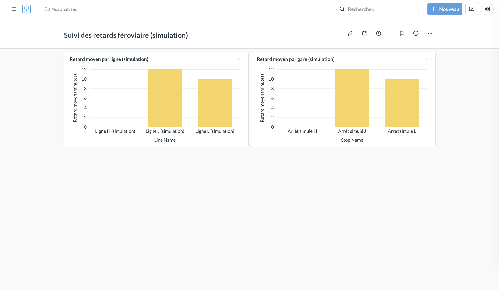

# SNCF Real-Time Lakehouse

Projet de data engineering local pour analyser des événements de retard ferroviaire avec Java, Kafka, PySpark et Delta Lake.

Le pipeline suit une architecture Bronze / Silver / Gold et publie les indicateurs dans PostgreSQL pour leur consultation avec Metabase.

> État actuel : pipeline local fonctionnel en simulation et parcours réel SNCF validé sur un échantillon de 10 événements jusqu'à Metabase. Un instantané GTFS-RT a été téléchargé manuellement, décodé et normalisé en Java : 16 978 événements ont été exportés en JSONL, dont 10 publiés dans Kafka puis traités. Les parcours utilisent des topics, tables Delta, checkpoints et schémas PostgreSQL séparés. Les tests Java/Python et la CI existent déjà. Le téléchargement automatique HTTP par Java, une commande complète de démonstration réelle et plusieurs critères de clôture V1 restent à finaliser.

## 1. Objectif et architecture

### Question métier

> Quelles lignes et quels arrêts concentrent les retards sur une période donnée ?

Indicateurs implémentés :

- Nombre d'événements par ligne et par fenêtre de 15 minutes.
- Nombre de courses distinctes avec plus de cinq minutes de retard par ligne et par fenêtre.
- Retard moyen et maximal par ligne.
- Nombre d'événements en retard, retard moyen et maximal par arrêt et par jour.

Deux parcours coexistent :

- Simulation : événements générés et référentiels CSV simulés, pour une démonstration contrôlée.
- Réel : événements issus d'un instantané SNCF GTFS-RT et enrichis avec un référentiel GTFS statique réel.

Le parcours réel validé porte sur 10 observations d'arrêt d'une seule course. Il ne constitue pas une mesure représentative de la ponctualité globale du réseau ou de la ligne.

### Flux de données

Parcours de simulation :

```text
Producteur Java / simulateur Python
    → Kafka : sncf.trip_updates.raw
    → Bronze Delta : JSON publié et métadonnées Kafka
    → Silver Delta : validation, déduplication, références simulées
    → Gold Delta : agrégats par ligne et par arrêt
    → PostgreSQL : schéma public, publication par upsert
    → Metabase : dashboard de simulation
```

Parcours réel actuellement validé :

```text
Téléchargement manuel du GTFS-RT et du GTFS statique
    → Décodage et mapping Java
    → Export JSONL de 16 978 événements
    → Publication Java de 10 événements sélectionnés
    → Kafka : sncf.trip_updates.real.raw
    → Bronze Delta dédiée
    → Silver Delta : validation, déduplication, références GTFS réelles
    → Gold Delta dédiée
    → PostgreSQL : schéma sncf_real, publication par upsert
    → Metabase : dashboard réel distinct
```

Les instantanés Protobuf sont conservés localement séparément de Bronze. Bronze conserve le JSON canonique reçu depuis Kafka, pas directement le fichier GTFS-RT complet.

Bronze et Silver utilisent Structured Streaming avec `availableNow=True` : chaque lancement traite les données disponibles puis se termine. Gold est recalculé en batch, puis publié dans PostgreSQL. Aucun des dashboards n'est actuellement alimenté par des jobs permanents.

Voir [la validation de la source SNCF réelle](docs/real-source.md) pour le périmètre, les résultats et les limites.

### Organisation du dépôt

```text
.
├── .github/workflows/ci.yml          # Tests Java et Python/Spark
├── docker-compose.yml               # Kafka, Kafka UI, PostgreSQL, Metabase
├── .env.example
├── requirements-simulator.txt
├── docs/
│   ├── data-contract.md
│   ├── metabase.md                   # Dashboard de simulation
│   ├── real-source.md                # Validation et limites du parcours réel
│   ├── runbook.md
│   └── screenshots/
├── infra/postgres/
│   ├── 001_gold_tables.sql           # Tables de simulation dans public
│   └── 002_real_gold_tables.sql      # Tables réelles dans sncf_real
├── producer-java/
│   ├── pom.xml
│   └── src/                         # Producteurs, lecteurs GTFS, mapper, tests
├── scripts/
│   ├── create_topics.sh
│   ├── create_real_topic.sh
│   ├── prepare_real_references.py
│   ├── run_demo.sh                   # Démonstration de simulation
│   ├── run_pipeline.sh               # Parcours standard de simulation
│   ├── simulate_trip_updates.py
│   └── snapshot_resume_state.py      # Captures du parcours de simulation
├── spark/
│   ├── requirements.txt
│   ├── resources/simulation/
│   ├── src/jobs/
│   ├── src/transforms/
│   └── tests/
└── data/
    ├── lakehouse/                    # Delta de simulation
    ├── checkpoints/                  # Checkpoints de simulation
    ├── lakehouse_real/               # Delta réel
    ├── checkpoints_real/             # Checkpoints réels
    ├── reference/real/sncf/           # Références réelles et manifeste
    ├── source_checks/                # Instantanés et exports locaux
    └── validation/                   # Captures de contrôle de reprise
```

Les données générées, archives GTFS, instantanés, exports JSONL et checkpoints ne sont pas nécessaires dans Git. Les scripts, contrats, tests et procédures doivent permettre de les recréer.

## 2. Stack et modèle de données

### Technologies

| Composant | Technologie | Rôle |
|---|---|---|
| Infrastructure | Docker Compose | Services locaux et volumes persistants |
| Bus d'événements | Apache Kafka 4.1.0, KRaft | Transport des messages |
| Inspection Kafka | Kafka UI | Consultation des topics et messages |
| Ingestion et normalisation | Java 17, Maven, Jackson | Simulation, décodage GTFS-RT, mapping et publication JSON |
| Formats de transport | GTFS-RT Protobuf et GTFS statique | Mises à jour de trajets et référentiels réels |
| Lecture Java | gtfs-realtime-bindings 0.0.8, Commons CSV 1.13.0 | Décodage Protobuf et lecture des CSV GTFS |
| Simulateur complémentaire | Python, confluent-kafka | Génération de volumes et de cas invalides |
| Traitements | PySpark 3.5.3 | Ingestion, transformations et agrégations |
| Stockage analytique | Delta Lake 3.2.0 | Couches Bronze / Silver / Gold |
| Restitution | PostgreSQL 17, psycopg | Publication des indicateurs |
| Visualisation | Metabase | Exploration des tables PostgreSQL |
| Tests | JUnit 5, pytest | Vérification du producteur et des transformations |

Kafka, Kafka UI, PostgreSQL et Metabase tournent dans Docker. Le producteur Java et les jobs Spark s'exécutent sur la machine hôte ; Spark utilise le mode `local[*]`.

### Couches du lakehouse

| Couche | Table / dossier | Contenu |
|---|---|---|
| Bronze | `bronze/trip_updates` | Payload JSON original, clé Kafka, topic, partition, offset et timestamps |
| Silver | `silver/trip_delays` | Événements typés, retards en minutes et noms de lignes / arrêts |
| Silver | `silver/rejected_events` | Payloads rejetés, métadonnées Kafka et motif de validation |
| Gold | `gold/delay_by_line_15min` | Agrégats par ligne et fenêtre de 15 minutes |
| Gold | `gold/station_delay_daily` | Agrégats quotidiens par arrêt |

Les mêmes structures analytiques sont utilisées dans deux périmètres :

| Composant | Simulation | Réel |
|---|---|---|
| Topic | `sncf.trip_updates.raw` | `sncf.trip_updates.real.raw` |
| Racine Delta | `data/lakehouse` | `data/lakehouse_real` |
| Checkpoints | `data/checkpoints` | `data/checkpoints_real` |
| Références | `spark/resources/simulation` | `data/reference/real/sncf` |
| Schéma PostgreSQL | `public` | `sncf_real` |

Tables PostgreSQL dans chacun des schémas :
- `gold_delay_by_line_15min`.
- `gold_station_delay_daily`.

Cette isolation est logique ; les deux schémas utilisent actuellement la même base et le même utilisateur PostgreSQL. Le publisher refuse les couples lakehouse/schéma non autorisés.

### Contrat et règles métier

Le format JSON est décrit dans [le contrat de données](docs/data-contract.md). Ce document doit encore être aligné sur toutes les décisions du mapping réel, notamment les retards négatifs et les timestamps reconstitués.

Règles communes :

- Clé Kafka : `trip_id`.
- Identifiant de déduplication : `event_id`.
- Conversion : `delay_minutes = delay_seconds / 60.0`.
- Retard significatif : `delay_seconds > 300`, soit strictement plus de cinq minutes.
- Silver applique un watermark d'un jour et `dropDuplicatesWithinWatermark` sur `event_id`.
- Les noms sont enrichis depuis les références correspondant au parcours choisi.

Mapping réel actuel :

- `source = sncf_gtfs_rt`, `event_type = trip_update`, `schema_version = 1`.
- Un événement par mise à jour d'arrêt retenue.
- Seules les courses et mises à jour d'arrêt `SCHEDULED` sont retenues.
- Les courses `ADDED` et `CANCELED`, ainsi que les arrêts `SKIPPED`, sont exclus du premier périmètre analytique et comptabilisés.
- Priorité à l'arrivée si elle contient explicitement `time` et `delay` ; sinon, sélection du départ s'il contient ces deux champs.
- `estimated_timestamp` vient du `time` sélectionné.
- `scheduled_timestamp` est reconstitué par `time - delay`, et non lu dans `stop_times.txt`.
- `event_timestamp` correspond à la publication de l'instantané GTFS-RT.
- `ingested_at` est conservé depuis l'export JSONL lors du rejeu ; il ne représente donc pas nécessairement l'instant exact d'envoi Kafka. Bronze ajoute son propre timestamp d'ingestion.
- Le mapper préserve les retards négatifs lorsqu'ils sont présents.
- `event_id` est un UUID déterministe incluant l'observation et ses caractéristiques, mais pas `ingested_at`. Une nouvelle publication de flux avec un autre timestamp représente une nouvelle observation.

Les compteurs d'événements ne sont pas des nombres de trains uniques. `delayed_trip_count` compte les courses distinctes ayant au moins une observation en retard significatif dans la fenêtre ; `delayed_event_count` compte les observations en retard significatif par arrêt et par jour.

Les fenêtres et jours du parcours réel sont fondés sur le timestamp d'observation du flux, pas sur les heures de passage. Les moyennes portent sur les observations conservées, et non sur une mesure globale de ponctualité.

## 3. Installation et démonstration en simulation

### Prérequis

- Docker et Docker Compose.
- JDK 17 et Maven.
- Python 3.12, version utilisée pour les validations locales et la CI.
- Bash, notamment sur macOS ou Linux.
- Accès Internet à la première installation pour télécharger les images et dépendances.

Exécuter les commandes suivantes à la racine du dépôt.

### Étape 1 — Configurer l'environnement

```bash
if [ ! -f .env ]; then
  cp .env.example .env
fi
```

Ne pas écraser un `.env` existant.

Modifier le mot de passe PostgreSQL dans `.env`, puis charger les variables :

```bash
set -a
source .env
set +a

python3.12 -m venv .venv
source .venv/bin/activate
python -m pip install -r spark/requirements.txt
python -m pip install -r requirements-simulator.txt
```

Le script `run_pipeline.sh` utilise actuellement PostgreSQL sur `localhost:5432`. Conserver `POSTGRES_PORT=5432` pour cette procédure. Le topic créé par `create_topics.sh` est également fixé à `sncf.trip_updates.raw`.

### Étape 2 — Démarrer les services

Sélectionner explicitement l'installation originale :

```bash
export COMPOSE_PROJECT_NAME=sncf-realtime-lakehouse
pwd
printf 'Projet Compose : %s\n' "$COMPOSE_PROJECT_NAME"
docker compose up -d
docker compose ps
```

Attendre que Kafka et PostgreSQL soient prêts avant de poursuivre. Pour consulter leurs logs :

```bash
docker compose logs --tail=100 kafka postgres
```

### Étape 3 — Initialiser Kafka et PostgreSQL

```bash
bash scripts/create_topics.sh

docker compose exec -T postgres sh -c \
  'PGPASSWORD="$POSTGRES_PASSWORD" psql -v ON_ERROR_STOP=1 -U "$POSTGRES_USER" -d "$POSTGRES_DB"' \
  < infra/postgres/001_gold_tables.sql
```

Le schéma PostgreSQL est initialisé explicitement : le fichier SQL n'est pas monté comme script d'initialisation dans le Docker Compose actuel.

### Étape 4 — Exécuter la démonstration

```bash
(
  unset LAKEHOUSE_ROOT CHECKPOINT_ROOT GTFS_REFERENCE_ROOT
  unset BRONZE_TRIP_UPDATES_PATH BRONZE_TRIP_UPDATES_CHECKPOINT_PATH
  unset POSTGRES_TARGET_SCHEMA

  export KAFKA_BOOTSTRAP_SERVERS=localhost:9092
  export KAFKA_TRIP_UPDATES_TOPIC=sncf.trip_updates.raw

  bash scripts/run_demo.sh
)
```

Ce script vérifie le topic, publie un événement simulé avec Java, puis lance Bronze, Silver, les contrôles qualité Silver, les deux agrégations Gold et la publication PostgreSQL.

Chaque lancement produit un nouvel événement. Pour vérifier une reprise sans nouvel envoi, utiliser uniquement `bash scripts/run_pipeline.sh`.

Il suppose que les services, le topic, les tables PostgreSQL et l'environnement `.venv` sont déjà prêts.

Les autres commandes de cette section supposent également les valeurs de simulation : ne pas conserver les variables du parcours réel exportées globalement dans le terminal.

Pour produire davantage de données puis les traiter :

```bash
python scripts/simulate_trip_updates.py --count 100
bash scripts/run_pipeline.sh
```

Pour retraiter uniquement les nouvelles données disponibles et republier les agrégats :

```bash
bash scripts/run_pipeline.sh
```

### Étape 5 — Consulter les résultats

- Kafka UI : inspection du topic et des messages.
- Metabase : configuration initiale et consultation des indicateurs.

Dans Metabase, ajouter une connexion PostgreSQL avec les paramètres suivants :

| Paramètre | Valeur |
|---|---|
| Hôte | `postgres` |
| Port | `5432` |
| Base | Valeur de `POSTGRES_DB` dans `.env` |
| Utilisateur | Valeur de `POSTGRES_USER` dans `.env` |
| Mot de passe | Valeur de `POSTGRES_PASSWORD` dans `.env` |

Utiliser `postgres`, et non `localhost`, car Metabase et PostgreSQL communiquent sur le réseau Docker.

Les visualisations se configurent dans l'interface Metabase. Aucun dashboard préconfiguré n'est provisionné par les scripts fournis.

### Dashboard de simulation

Le dashboard « Suivi des retards ferroviaire (simulation) » présente
deux graphiques :
- Retard moyen par ligne.
- Retard moyen par gare.

Les graphiques consultent les tables PostgreSQL
`public.gold_delay_by_line_15min` et `public.gold_station_delay_daily`.

Les données sont simulées et ne représentent pas la ponctualité réelle
du réseau SNCF. Les traitements sont exécutés à la demande :
actualiser le dashboard ne lance pas le pipeline.



La capture illustre une configuration locale ; le dashboard n'est pas
automatiquement provisionné lors du lancement depuis un nouveau clone.

## 4. Parcours réel SNCF — Exécution à la demande

### État validé et prérequis

Le parcours réel a été validé avec un téléchargement manuel et un rejeu limité à 10 événements. Il n'existe pas encore de script unique de démonstration réelle ni de collecte HTTP intégrée au producteur.

Cette procédure suppose que l'installation de simulation a déjà initialisé l'infrastructure, les dépendances et les tables `public`. Le script SQL réel copie leur structure.

Exécuter les commandes depuis la racine du dépôt original. Ne pas modifier le topic par défaut de `.env` et ne pas lancer `run_demo.sh` ou `run_pipeline.sh` pour orchestrer le parcours réel.

### Étape 1 — Télécharger les sources

```bash
export COMPOSE_PROJECT_NAME=sncf-realtime-lakehouse

mkdir -p data/source_checks
SOURCE_DIR="$(mktemp -d data/source_checks/sncf-XXXXXX)"

REALTIME_FILE="$PWD/$SOURCE_DIR/trip_updates.pb"
GTFS_ZIP="$PWD/$SOURCE_DIR/sncf_gtfs.zip"

curl --fail --location --silent --show-error \
  --connect-timeout 10 --max-time 60 \
  --output "$REALTIME_FILE" \
  'https://proxy.transport.data.gouv.fr/resource/sncf-gtfs-rt-trip-updates'

curl --fail --location --silent --show-error \
  --connect-timeout 10 --max-time 180 \
  --output "$GTFS_ZIP" \
  'https://eu.ftp.opendatasoft.com/sncf/plandata/Export_OpenData_SNCF_GTFS_NewTripId.zip'
```

Si un téléchargement échoue, arrêter la procédure. Les fichiers téléchargés peuvent être incomplets et ne doivent pas être utilisés comme des sources validées.

Chaque exécution crée un nouveau dossier. Les effectifs des sources évoluent : les résultats historiques ci-dessous ne sont pas des valeurs fixes attendues pour tout nouvel instantané.

### Étape 2 — Inspecter et exporter avec Java

```bash
JSONL_OUTPUT="$PWD/$SOURCE_DIR/trip_updates.canonical.jsonl"

(
  set -e
  cd producer-java

  mvn --batch-mode --no-transfer-progress test

  mvn --batch-mode --no-transfer-progress compile exec:java \
    -Dexec.mainClass=fr.remyqueny.sncf.producer.GtfsRealtimeInspector \
    -Dexec.args="\"$REALTIME_FILE\""

  mvn --batch-mode --no-transfer-progress exec:java \
    -Dexec.mainClass=fr.remyqueny.sncf.producer.GtfsStaticReference \
    -Dexec.args="\"$GTFS_ZIP\""

  mvn --batch-mode --no-transfer-progress exec:java \
    -Dexec.mainClass=fr.remyqueny.sncf.producer.GtfsRealtimeEnrichmentInspector \
    -Dexec.args="\"$REALTIME_FILE\" \"$GTFS_ZIP\""

  mvn --batch-mode --no-transfer-progress exec:java \
    -Dexec.mainClass=fr.remyqueny.sncf.producer.GtfsRealtimeJsonExporter \
    -Dexec.args="\"$REALTIME_FILE\" \"$GTFS_ZIP\" \"$JSONL_OUTPUT\""
)
```

Vérifier les compteurs de résolution et d'exclusion avant de publier. L'inspecteur affiche deux exemples ; l'exporter convertit tous les candidats acceptés et vérifie l'unicité des identifiants.

L'exporter refuse d'écraser un fichier existant. Il écrit une sortie `.partial`, renommée seulement après réussite. Un `.partial` laissé après un échec n'est pas un export valide.

### Étape 3 — Préparer les références réelles

Pour conserver la provenance de chaque préparation, utiliser un dossier correspondant au téléchargement :

```bash
REFERENCE_DIR="$PWD/data/reference/real/$(basename "$SOURCE_DIR")"

.venv/bin/python scripts/prepare_real_references.py \
  "$GTFS_ZIP" "$REFERENCE_DIR"
```

Le script génère `routes.csv`, `stops.csv` et `manifest.json`. Il refuse les identifiants dupliqués, les noms absents et un dossier cible déjà existant.

Le nom de ligne utilise `route_long_name`, ou `route_short_name` si le nom long est vide. Le manifeste conserve l'empreinte SHA-256 de l'archive et la date de préparation.

Le test historique a utilisé `data/reference/real/sncf`. Le job Silver accepte également le dossier spécifique défini ici via `GTFS_REFERENCE_ROOT`.

### Étape 4 — Initialiser le topic et les tables réelles

```bash
bash scripts/create_real_topic.sh

docker compose exec -T postgres sh -c \
  'PGPASSWORD="$POSTGRES_PASSWORD" psql -X -v ON_ERROR_STOP=1 \
   -U "$POSTGRES_USER" -d "$POSTGRES_DB"' \
  < infra/postgres/002_real_gold_tables.sql
```

Le topic réel utilise une partition et un facteur de réplication de 1. Les tables du schéma `sncf_real` reprennent la structure des tables `public`, sans copier leurs données.

### Étape 5 — Publier un petit échantillon

Vérifier que l'export contient au moins 10 lignes avant cette commande :

```bash
wc -l "$JSONL_OUTPUT"

(
  cd producer-java

  KAFKA_BOOTSTRAP_SERVERS=localhost:9092 \
  mvn --batch-mode --no-transfer-progress exec:java \
    -Dexec.mainClass=fr.remyqueny.sncf.producer.RealJsonlProducer \
    -Dexec.args="\"$JSONL_OUTPUT\" 10"
)
```

`RealJsonlProducer` valide la sélection avant l'envoi, utilise `trip_id` comme clé et cible exclusivement `sncf.trip_updates.real.raw`. Le nombre demandé doit être compris entre 1 et 20 000 et ne pas dépasser les lignes disponibles.

Ne pas répéter cette commande pour une simple vérification : elle republie les mêmes événements. Si certains messages ont été livrés avant un échec, diagnostiquer la reprise avant un nouvel envoi. L'idempotence du producteur Kafka ne déduplique pas automatiquement deux exécutions distinctes.

### Étape 6 — Exécuter Bronze, Silver, les contrôles et Gold

La validation historique a utilisé les racines dédiées ci-dessous. Ces commandes ne suppriment aucun checkpoint et ne réinitialisent aucune table.

```bash
(
  set -e

  export PYTHONPATH="$PWD/spark/src"
  export PYSPARK_PYTHON="$PWD/.venv/bin/python"
  export KAFKA_BOOTSTRAP_SERVERS=localhost:9092
  export KAFKA_TRIP_UPDATES_TOPIC=sncf.trip_updates.real.raw

  export LAKEHOUSE_ROOT="$PWD/data/lakehouse_real"
  export CHECKPOINT_ROOT="$PWD/data/checkpoints_real"
  export GTFS_REFERENCE_ROOT="$REFERENCE_DIR"

  export BRONZE_TRIP_UPDATES_PATH="$LAKEHOUSE_ROOT/bronze/trip_updates"
  export BRONZE_TRIP_UPDATES_CHECKPOINT_PATH="$CHECKPOINT_ROOT/bronze_trip_updates"

  .venv/bin/python spark/src/jobs/stream_bronze.py
  .venv/bin/python spark/src/jobs/stream_silver.py
  .venv/bin/python spark/src/jobs/inspect_silver.py
  .venv/bin/python spark/src/jobs/build_gold_delay_by_line.py
  .venv/bin/python spark/src/jobs/build_gold_station_delay_daily.py
)
```

Les variables restent limitées au sous-shell. Ne pas modifier le topic consommé en réutilisant un checkpoint de simulation.

Un nouveau référentiel ne réenrichit pas automatiquement les événements déjà écrits dans Silver. Les traitements réels restent cumulatifs : sur une installation déjà utilisée, une nouvelle publication peut augmenter les effectifs au-delà de 10.

### Étape 7 — Publier Gold dans sncf_real

```bash
(
  set -e

  export COMPOSE_PROJECT_NAME=sncf-realtime-lakehouse
  export PYTHONPATH="$PWD/spark/src"
  export PYSPARK_PYTHON="$PWD/.venv/bin/python"
  export LAKEHOUSE_ROOT="$PWD/data/lakehouse_real"
  export POSTGRES_TARGET_SCHEMA=sncf_real
  export POSTGRES_HOST=localhost
  export POSTGRES_PORT=5432

  POSTGRES_USER="$(docker compose exec -T postgres sh -c \
    'printf "%s" "$POSTGRES_USER"')"
  POSTGRES_DB="$(docker compose exec -T postgres sh -c \
    'printf "%s" "$POSTGRES_DB"')"
  POSTGRES_PASSWORD="$(docker compose exec -T postgres sh -c \
    'printf "%s" "$POSTGRES_PASSWORD"')"

  export POSTGRES_USER POSTGRES_DB POSTGRES_PASSWORD

  .venv/bin/python spark/src/jobs/publish_postgres.py
)
```

Vérifier dans les logs la racine `data/lakehouse_real/gold` et le schéma `sncf_real`. Ne pas partager les identifiants ou le mot de passe.

Pour contrôler les données publiées :

```bash
docker compose exec -T postgres sh -c \
  'PGPASSWORD="$POSTGRES_PASSWORD" psql -X -v ON_ERROR_STOP=1 \
   -U "$POSTGRES_USER" -d "$POSTGRES_DB"' <<'SQL'
SELECT window_start, window_end, line_name, event_count,
       delayed_trip_count, average_delay_minutes, max_delay_minutes
FROM sncf_real.gold_delay_by_line_15min
ORDER BY window_start, route_id;

SELECT COUNT(*) AS aggregate_count,
       SUM(event_count) AS total_events,
       SUM(delayed_event_count) AS significant_delay_events
FROM sncf_real.gold_station_delay_daily;
SQL
```

### Résultats du test historique du 8 octobre 2026

| Contrôle | Résultat |
|---|---:|
| Courses dans le GTFS-RT | 2 001 |
| Mises à jour d'arrêt dans le GTFS-RT | 17 869 |
| Courses SCHEDULED enrichies | 1 776 |
| Courses ADDED exclues | 196 |
| Courses CANCELED exclues | 29 |
| Arrêts exclus avec ces courses | 838 |
| Arrêts SKIPPED exclus | 53 |
| Événements JSONL exportés et identifiants distincts | 16 978 |
| Événements publiés et présents dans Bronze / Silver | 10 |
| Rejets Silver / noms non résolus sur l'échantillon | 0 |
| Agrégats Gold / PostgreSQL par ligne | 1 |
| Agrégats Gold / PostgreSQL par arrêt | 10 |

Le bilan de conversion est : `17 869 = 838 + 53 + 16 978`.

Pour les 10 observations de la course sélectionnée :

- Ligne : `Lux/Alsace/Loraine - Paca`.
- Timestamp du flux : `2026-10-08T17:18:01Z`.
- Fenêtre UTC : `17:15:00` à `17:30:00`.
- Retard moyen : 1,5 minute ; maximal : 5 minutes.
- Colmar, Mulhouse et Belfort - Montbéliard TGV : 5 minutes.
- Les sept autres arrêts : 0 minute.
- Compteurs de retard strictement supérieur à 5 minutes : 0.

Ces résultats sont ceux d'un échantillon validé, pas une prévision du contenu des futurs flux.

### Dashboard réel

Un dashboard distinct a été configuré manuellement :

`Retards SNCF — Données réelles (échantillon)`

Il présente deux questions SQL sur les tables du schéma `sncf_real` :

- Retard moyen par ligne.
- Retard moyen par arrêt.

Les moyennes regroupant plusieurs agrégats sont pondérées par `event_count`. Par exemple :

```sql
SELECT
    line_name AS ligne,
    ROUND(
        (SUM(average_delay_minutes * event_count)
         / NULLIF(SUM(event_count), 0))::numeric,
        2
    ) AS retard_moyen_minutes
FROM sncf_real.gold_delay_by_line_15min
GROUP BY route_id, line_name
ORDER BY retard_moyen_minutes DESC, ligne;
```

```sql
SELECT
    stop_name AS arret,
    ROUND(
        (SUM(average_delay_minutes * event_count)
         / NULLIF(SUM(event_count), 0))::numeric,
        2
    ) AS retard_moyen_minutes
FROM sncf_real.gold_station_delay_daily
GROUP BY stop_id, stop_name
ORDER BY retard_moyen_minutes DESC, arret;
```

Ces requêtes utilisent toutes les dates disponibles ; les filtres de période restent à ajouter. Les moyennes Gold sont arrondies à deux décimales : leur recomposition peut être légèrement approximative.

Le dashboard réel n'est pas automatiquement provisionné. Actualiser Metabase ne télécharge pas de source et ne lance pas le pipeline. La capture du dashboard de simulation ne constitue pas une preuve visuelle du dashboard réel.

## 5. Tests et fiabilité

### Tests Java et Python

```bash
(cd producer-java && mvn test)

PYTHONPATH="$PWD/spark/src" \
PYSPARK_PYTHON="$PWD/.venv/bin/python" \
.venv/bin/python -m pytest spark/tests -v
```

Les suites couvrent notamment la sérialisation JSON, la cohérence des événements Java, la couverture des références simulées, les transformations et agrégations Python ainsi que les contrôles qualité Silver.

Huit tests ont été ajoutés pour `GtfsStopEventMapper` : priorité à l'arrivée, repli sur le départ avec retard zéro explicite, absence de retard explicite, retard négatif, stabilité de l'identifiant lorsque seule l'ingestion change, nouvel identifiant pour un autre instantané, exclusions métier et absence de ligne.

Ces commandes permettent de vérifier les tests localement. Les dernières validations locales ont réussi pour 12 tests Java (4 existants et 8 tests du mapper réel) et 40 cas Python. Les cas paramétrés sont comptés séparément : 40 cas Python ne signifie pas 40 fonctions de test.

### Intégration continue

La CI est définie dans `.github/workflows/ci.yml`. Elle exécute les tests Java et Python/Spark lors des push et des pull requests, et peut être lancée manuellement.

La CI existe déjà et les deux jobs ont été exécutés avec succès, avec Java 17 et Python 3.12 sur un runner Linux. Consulter l'onglet Actions pour le résultat du commit courant ; une réussite locale ne prouve pas à elle seule celle de ce commit sur GitHub.

Le workflow ne démarre pas Kafka, PostgreSQL ou Metabase : il ne valide pas de bout en bout la simulation ou le parcours réel. Il n'inclut pas encore de lint bloquant.

### Logs du producteur Java

Le producteur utilise `slf4j-api` et `slf4j-simple` en version `1.7.36`. Le fichier de propriétés SLF4J présent dans le dépôt doit être vérifié séparément ; le bilan ci-dessous porte sur les logs observés pendant les exécutions.

- Les messages applicatifs sont écrits au niveau `INFO` pour les succès et `ERROR` pour les échecs.
- Le succès est journalisé après l'accusé de réception Kafka, avec `event_id`, topic, partition et offset.
- Les erreurs incluent le type d'exception, le message et la trace de l'exception.
- Les logs applicatifs utilisent un format texte `clé=valeur`, pas un format JSON.

Le chemin d'erreur du producteur initial a été vérifié avec `SIMULATION_MODE=false`, qui reste non implémenté dans `ProducerApplication` et échoue avant tout envoi Kafka.

Le parcours réel utilise actuellement des classes distinctes (`GtfsRealtimeJsonExporter` puis `RealJsonlProducer`), et non ce flag. `RealJsonlProducer` journalise la validation préalable, les accusés de réception Kafka et le nombre livré. Il ne télécharge pas la source HTTP.

### Contrôle des événements invalides

```bash
python scripts/simulate_trip_updates.py --count 10 --invalid
bash scripts/run_pipeline.sh
```

Le simulateur injecte des cas avec `trip_id` absent, retard non numérique ou timestamp invalide. Silver conserve les rejets dans `silver/rejected_events` avec leur payload et un motif d'erreur.

Avant les calculs Gold et la publication PostgreSQL, `inspect_silver.py` vérifie les doublons d'`event_id`, les champs obligatoires contrôlés et la cohérence entre secondes et minutes. Une anomalie bloquante interrompt le pipeline ; les événements déjà classés dans `rejected_events` restent consultables.

Ces contrôles ne garantissent pas encore la conformité à toutes les exigences du contrat ni la présence de toutes les références d'enrichissement.

### Reprise après relancement

Les captures et commandes ci-dessous concernent la simulation. Le script `snapshot_resume_state.py` existant n'a pas été adapté pour comparer le parcours réel ; ne pas l'utiliser comme une preuve de reprise réelle.

Exécuter ce contrôle avec les chemins et le schéma de simulation, sans variables réelles persistantes dans le terminal.

Les requêtes Bronze et Silver disposent de checkpoints distincts. PostgreSQL utilise des upserts sur les clés `(window_start, route_id)` et `(event_date, stop_id)`.

Les captures `data/validation/reprise_before.json` et `reprise_after.json` présentent le même état Silver / PostgreSQL pour le scénario fourni. Elles documentent un contrôle local, pas une garantie universelle d'exactly-once.

Pour reproduire un contrôle sans produire de nouvel événement, choisir deux noms de fichiers encore inexistants :

```bash
export PYTHONPATH="$PWD/spark/src"
export PYSPARK_PYTHON="$PWD/.venv/bin/python"

.venv/bin/python scripts/snapshot_resume_state.py data/validation/check_before.json
bash scripts/run_pipeline.sh
.venv/bin/python scripts/snapshot_resume_state.py data/validation/check_after.json

diff -u data/validation/check_before.json data/validation/check_after.json
```

Ne pas supprimer les checkpoints pour un simple redémarrage : ils conservent l'état de progression des traitements. La déduplication Silver est bornée par le watermark, et non garantie sans limite temporelle.

Pour arrêter les services sans supprimer leurs volumes :

```bash
docker compose down
```
### Validation depuis un clone isolé

Un test local a été réalisé dans un clone utilisant le projet Compose
`sncf-realtime-lakehouse-cleancheck`, avec l'installation originale arrêtée
pour libérer les ports.

Résultats vérifiés :
- Création du topic `sncf.trip_updates.raw`.
- Deuxième exécution du script de création sans modification du TopicId.
- Initialisation des deux tables PostgreSQL de restitution.
- Exécution de la démonstration jusqu'à la publication Gold dans PostgreSQL.
- Un événement comptabilisé dans chaque agrégat, avec un retard de 2 minutes.
- Relance du pipeline sans nouvel événement : données Silver et PostgreSQL
  identiques avant et après, vérifiées par comparaison des captures JSON.

Ce test a révélé une dépendance au nom fixe du conteneur `sncf-kafka`.
Le script `create_topics.sh` utilise désormais le service Compose `kafka`.

Les captures `cleancheck_before.json` et `cleancheck_after.json` ont été produites dans le clone pendant le test. Leur disponibilité après nettoyage dépend de leur archivage local ; elles ne sont pas automatiquement reconstituées par Git.

Ne pas les confondre avec les anciennes captures `reprise_before.json` et `reprise_after.json`.

Ce contrôle valide le scénario exécuté ; il ne constitue pas une garantie
universelle d'exactly-once ni une validation du dashboard Metabase.

## 6. Avancement et prochaines étapes

### Implémenté et validé

- [x] Infrastructure Docker Compose : Kafka, Kafka UI, PostgreSQL et Metabase.
- [x] Topics de simulation et réel créés par des scripts versionnés.
- [x] Contrat JSON documenté pour la simulation.
- [x] Producteur Java simulé et simulateur Python avec cas invalides.
- [x] Ingestion Bronze, validation / déduplication / enrichissement Silver.
- [x] Rejets Silver traçables et contrôles bloquants avant Gold.
- [x] Agrégats Gold par ligne et par arrêt, publication PostgreSQL par upsert.
- [x] Scripts de démonstration et de traitement de simulation.
- [x] Tests locaux : 12 tests Java et 40 cas Python validés.
- [x] CI GitHub Actions existante pour Java et Python/Spark.
- [x] Dashboard de simulation documenté et capture versionnée.
- [x] Runbook de simulation et validation locale depuis un clone.
- [x] Contrôle de reprise de simulation sans nouvel événement.
- [x] Téléchargement manuel et inspection d'un instantané SNCF réel.
- [x] Lecture Java du GTFS statique, mapping réel et 8 tests dédiés.
- [x] Export JSONL réel complet de l'instantané testé : 16 978 événements.
- [x] Préparation des référentiels réels avec manifeste de provenance.
- [x] Isolation des topics, tables Delta, checkpoints et schémas PostgreSQL.
- [x] Garde-fou du publisher sur le couple lakehouse / schéma.
- [x] Validation de 10 événements réels jusqu'à PostgreSQL et Metabase.
- [x] Documentation du bilan réel dans `docs/real-source.md`.

### À finaliser pour la V1

- [ ] Implémenter le téléchargement HTTP en Java avec délais, erreurs et conservation du mode simulation.
- [ ] Fournir une commande ou un script reproductible pour le parcours réel, sans dépendre de variables préparées manuellement.
- [ ] Aligner `docs/data-contract.md` sur le mapping réel et les décisions métier.
- [ ] Compléter les contrôles Silver sur les champs et règles du contrat retenu.
- [ ] Tester la reprise du parcours réel sans nouvelle publication et conserver une preuve distincte.
- [ ] Valider un échantillon réel plus diversifié : plusieurs courses, lignes et retards significatifs.
- [ ] Compléter les visualisations et filtres de période, avec leur procédure de création.
- [ ] Versionner une preuve visuelle spécifique du dashboard réel.
- [ ] Compléter le runbook pour les sources, références et publications réelles.
- [ ] Compléter la documentation d'architecture, des timestamps et de la sémantique des indicateurs.
- [ ] Ajouter les contrôles de qualité de code prévus, sans recréer la CI existante.
- [ ] Acter le périmètre de clôture concernant les alertes et la DLQ Kafka.

La V1 n'est pas déclarée terminée uniquement parce que l'échantillon réel fonctionne.

### Limites actuelles

- Le producteur simulé publie un événement par exécution ; son flag `SIMULATION_MODE=false` n'active pas le parcours réel.
- Le parcours réel repose sur des fichiers téléchargés manuellement et des outils Java séparés.
- Seuls 10 événements réels ont été validés de bout en bout, contre 16 978 exportés.
- Les courses ajoutées ou annulées et les arrêts sautés sont exclus du premier périmètre de retard, avec des compteurs d'exclusion.
- Les horaires théoriques réels sont reconstitués depuis `time - delay` ; les fenêtres utilisent la publication du flux.
- Plusieurs instantanés peuvent produire plusieurs observations du même passage : les agrégats actuels ne constituent pas un calcul de ponctualité finale ou de dernière prévision par passage.
- Les traitements sont lancés à la demande, pas en continu.
- Gold est recalculé avec `overwrite` depuis Silver.
- PostgreSQL est alimenté par upsert ; les lignes qui disparaissent de Gold ne sont pas automatiquement supprimées de PostgreSQL.
- Le publisher collecte les agrégats sur le driver et refuse plus de 10 000 lignes par table.
- La validation Silver ne couvre pas encore toutes les règles du contrat.
- Les UUID déterministes et l'idempotence Kafka ne garantissent pas un exactly-once universel.
- Les dashboards sont configurés manuellement et ne sont pas provisionnés dans une nouvelle installation.
- Les alertes de service et la DLQ Kafka ne sont pas implémentées.
- Un seul broker Kafka est utilisé : le projet local n'est pas une infrastructure de production haute disponibilité.

### Évolutions envisagées

Airflow relève de la V2 : rafraîchissement des références, contrôles périodiques, recalculs et publications batch. Il n'est pas requis pour clôturer l'exécution locale V1.

Azure reste une trajectoire optionnelle, sans dépendance cloud ni coût imposé à la V1.

Ne pas versionner `.env`, les secrets, les instantanés téléchargés, les exports volumineux, les données Delta ni les checkpoints.
